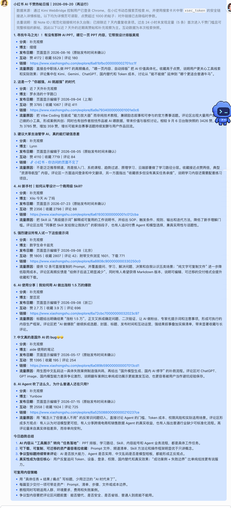

# xhs-ai-daily

一个用于监控小红书 AI 热帖、生成中文日报并通过飞书交付的 Agent Skill。

## 中文简介

如果你每天需要关注小红书上的 AI、人工智能、AIGC、AI 工具、AI 应用、AI 学习、AI 绘画、AI 视频或 AI 办公内容，这个 Skill 可以把人工刷帖流程整理成一条可复用工作流：

1. 使用 **Kimi WebBridge** 控制用户已经登录的 Chrome。
2. 在小红书动态搜索页检索指定关键词。
3. 从搜索结果卡片提取带 `xsec_token` 的安全详情链接。
4. 进入原帖核验标题、作者、发布时间、点赞、收藏、评论、分享和评论区内容。
5. 只保留点赞超过 1,000 的帖子。
6. 使用 Note ID 和规范化链接执行 7 天去重。
7. 输出包含“为什么会火”和“可复用策略”的中文日报。
8. 通过飞书用户身份发送给指定联系人或群聊。

它适合：

- 小红书运营和选题监控
- 竞品和行业热点跟踪
- AI 产品、工具和模型动态观察
- 内容团队每日情报分发
- 个人创作者建立可复用的热点素材库

## 日报示例

下面是一份实际生成的日报截图示例。敏感的个人凭据、Cookie、Token、联系人信息和永久台账不会放入公开仓库。



## 核心能力

- **真实页面检索**：要求通过 Kimi WebBridge 读取已登录 Chrome 中的小红书动态页面。
- **原帖核验**：不使用搜索引擎摘要、第三方聚合页或公开静态 HTML 替代详情核验。
- **千赞筛选**：默认只纳入点赞数超过 1,000 的帖子。
- **7 天去重**：按照 Note ID 或不含临时参数的规范化链接去重。
- **追踪更新**：若历史帖子点赞数明显增长，可作为追踪更新重新出现，并说明上次和本次快照。
- **日报分析**：除标题、链接、作者和互动数据外，还分析选题、痛点、评论情绪、实用性、热点借势和平台分发逻辑。
- **飞书交付**：默认使用用户身份发送，不把 Bot 身份或内部凭据写进报告。
- **失败保护**：如果无法访问已登录 Chrome 的动态小红书数据，不发送空报或趋势替代日报。

## 安全边界

公开仓库中**不包含**：

- Chrome Cookie 或登录态
- 飞书 access token、refresh token、appSecret
- 私人联系人 open_id
- 个人 `memory.md`
- 永久 `posts_ledger.jsonl`
- 自动化任务的私有配置

使用者需要自行安装 Kimi WebBridge、登录小红书，并在本地配置自己的日报路径和飞书授权。

## 安装

将 `xhs-ai-daily-skill` 目录复制到目标 Agent 的 skills 目录，或使用目标平台对应的 Skill 发布器安装。

最小合法 Skill 只需要：

```text
xhs-ai-daily-skill/
└── SKILL.md
```

## 本地配置示例

请使用私有配置文件或自动化环境传入个人值，不要直接提交到 GitHub：

```toml
[paths]
automation_dir = "/private/path/to/automation"
ledger = "/private/path/to/posts_ledger.jsonl"
memory = "/private/path/to/memory.md"

[feishu]
recipient_open_id = "replace-locally"
as_identity = "user"

[search]
like_threshold = 1000
dedup_days = 7
```

## 相关视频

本工作流的竖版视频脚本、镜头结构和小红书发布文案，见本地项目中的 `xhs-ai-daily-video/VIDEO_PLAN.md`。

## License

MIT
